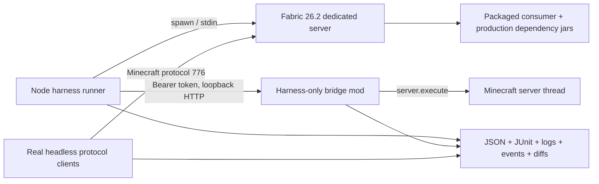

# Architecture

## Scope

The harness owns release-level behavior at real process and network boundaries.
Consumer repositories continue to own unit tests and Fabric GameTests. This
repository consumes packaged jars and tests what those fast layers cannot:

- dedicated-server boot and shutdown;
- production jar metadata/dependency packaging;
- multiple real network sessions;
- interaction packets, death/respawn, disconnect/reconnect, and restart;
- config files as packaged and reloaded;
- cross-mod behavior and persistence;
- bounded soak/performance and global failure detection.

## Runtime topology

The bridge is not a substitute for clients. Clients exercise networking and
interaction. The bridge provides deterministic setup and server-observable
assertions that would otherwise require fragile log scraping.

## Reproducible pins and downloads

`config/pins.yaml` is the single default version source:

| Component | Pin |
|---|---:|
| Java | 25 |
| Minecraft | 26.2 |
| protocol | 776 |
| Fabric Loader | 0.19.3 |
| Fabric API | 0.154.2+26.2 |
| Fabric installer | 1.1.1 |

The launcher comes from Fabric Meta's versioned server endpoint. Fabric API
comes from Fabric's Maven repository. Downloads are cached, consumer-provided
checksums are enforced, and checksums for every installed artifact are emitted
with each run. The harness never silently falls back to a different Minecraft,
Loader, API, Java, or protocol version.

## Isolation and lifecycle

Every invocation gets one output root containing an isolated `server/` and
`artifacts/` directory. World, config, player data, logs, and ports do not leak
between invocations. Restarts preserve the same directory only inside the same
scenario. Startup waits for an explicit server or bridge-ready signal; shutdown
uses `stop`, then a bounded force-stop fallback.

Cleanup errors are attached as secondary evidence and never replace the first
startup, download, scenario, or assertion error.

## Real clients

An isolated Rust process per player uses Azalea's exact Minecraft 26.2 packet
implementation (protocol 776), pinned to commit
`c35b57ebf82fa8b26ada77ab9eb795e3827d6c16`. The pin is intentional: the
published Azalea crate still targets 26.1, while its current upstream main is
versioned `0.16.0+mc26.2`. `doctor` executes the built client and rejects any
reported game/protocol mismatch. Each offline-mode username yields a stable
server identity.

The JSON-lines wrapper records spawn, respawn, death, health, chat, window,
player join/leave, error, and disconnect events plus live inventory/state
snapshots. It exposes movement, look, block use/place/break, attacks, commands,
respawn, and common inventory-window clicks. Every client is a real TCP session;
the bridge cannot synthesize or stand in for one.

## Test-only bridge

The bridge:

- binds only to `127.0.0.1` on a random port;
- requires a cryptographically random bearer token on every request;
- schedules Minecraft reads/mutations through `MinecraftServer.execute`;
- provides health, tick/MSPT, players, inventory/components, item entities,
  block-entity SNBT, commands, damage, block fixtures, permissions, tick waits,
  and adapter endpoints;
- emits timestamped NDJSON lifecycle/control events;
- includes a test-only Fabric Permissions API provider with allow/deny/default;
- exposes `HarnessAdapter` so a harness-only consumer adapter can add structured
  domain reads without changing a production jar.

The bridge jar is copied only into the isolated run directory. Consumer build
files and release artifacts never reference or include it.

## Failure model

A run exits zero only if all steps and global rules pass. Independently of
scenario assertions, the harness fails on:

- ERROR/FATAL lines (with explicit, narrow allowlists only);
- stack traces and uncaught/unhandled errors;
- watchdog/stall/hang signatures;
- crash reports or premature server exit;
- wrong-thread/thread-check/concurrent-modification signatures;
- startup, command, step, client, tick-wait, and shutdown timeouts.

Soak scenarios also evaluate configurable error-rate and MSPT percentile
thresholds. Reports contain the original error, per-step evidence, and a server
log tail.

## Extension boundary

Most new mods need only YAML. Standard operations cover lifecycle, clients,
console/bridge control, files, SQLite reads, snapshots, waits, logs, and soak.
When a mod has opaque internal state, place a separate test adapter jar beside
the consumer jar and implement `HarnessAdapter`; never add bridge dependencies to
production code.

The scenario schema and report schema are versioned independently from consumer
mods. New fields remain optional within schema version 1; breaking semantics
require schema version 2.

## Research basis

- Fabric's current version generator reports Fabric API `0.154.2+26.2` for
  Minecraft 26.2: [Fabric Develop](https://fabricmc.net/develop/).
- Fabric Meta documents the versioned server-launcher endpoint used by the
  resolver: [Fabric Meta](https://meta.fabricmc.net/).
- Fabric's project structure makes the server environment and entrypoint
  boundary explicit: [Fabric project structure](https://docs.fabricmc.net/develop/getting-started/project-structure).
- Fabric API's own contribution guidance calls for automated failures plus
  production dedicated-server testing in addition to development/GameTests:
  [Fabric API testing guidance](https://github.com/FabricMC/fabric-api/blob/26.1.2/CONTRIBUTING.md#testing).
- Azalea's current protocol source declares protocol `776`, and the pinned
  workspace declares version `0.16.0+mc26.2`:
  [Azalea protocol source](https://github.com/azalea-rs/azalea/blob/c35b57ebf82fa8b26ada77ab9eb795e3827d6c16/azalea-protocol/src/packets/mod.rs),
  [Azalea workspace pin](https://github.com/azalea-rs/azalea/blob/c35b57ebf82fa8b26ada77ab9eb795e3827d6c16/Cargo.toml).
